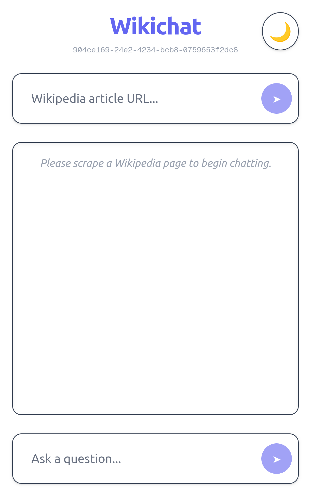
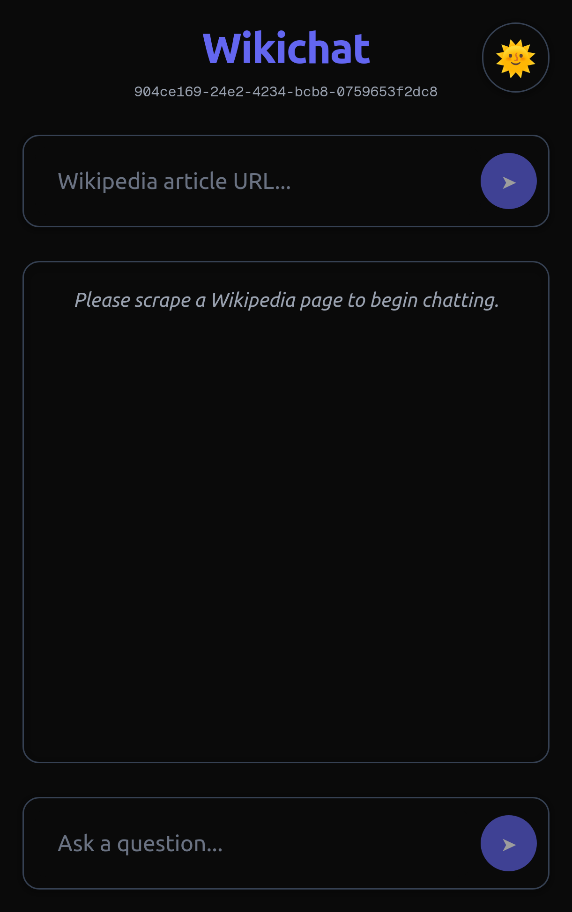

<div align="center" style="margin-top:50px;margin-bottom:50px;">
    
</div>

<p align="center">
<a href="https://wikichat.vercel.app"><a/>
<a href="https://github.com/nating/wikichat/LICENSE"><a/>
<a href="https://img.shields.io/badge/PRs-welcome-brightgreen.svg"><a/>
</p>

> **Wikichat** is a professional-grade RAG chatbot that lets you scrape any Wikipedia article and ask intelligent, contextual questions. Beautifully designed and easily deployable on Vercel.

---

## 🚀 Features

- ⚡️ **Real-time Wikipedia RAG chat** using OpenAI
- 📚 **Scrape and embed** any Wikipedia article
- 🧠 **Chunked embeddings** using `@ai-sdk/openai` and Pinecone
- 🧩 **Neon + Drizzle ORM** for scalable, type-safe Postgres access
- 📍 **Logging & request tracing** with Pino
- 🎨 **Beautiful, responsive UI** powered by Tailwind CSS v4
- 🌗 **Dark mode toggle** and persistent theme settings
- 📦 **CI-ready** and deployable with Vercel
- 🧪 **Some testing**: with simple AI generated tests for components, routes, logic etc...)

---

## 🌐 Try it out here!

📡 [https://wikichat.vercel.app](https://wikichat.vercel.app)

---

## 📲 Install via the World App

Scan the QR code below in the **World App** to instantly install Wikichat on your phone.

<div align="center">
  
</div>

---

## 🧑‍💻 Tech Stack

| Technology       | Purpose                              |
|------------------|--------------------------------------|
| Next.js 15       | App framework                        |
| Tailwind CSS v4  | Utility-first styling                |
| Vercel AI SDK    | Chat + Embedding API & hooks         |
| OpenAI           | Embedding + Language Model           |
| Pinecone         | Vector DB                            |
| Neon             | Serverless Postgres                  |
| Drizzle ORM      | Typed DB queries                     |
| Puppeteer Core   | Wikipedia scraping                   |
| Pino             | Structured logging & request tracing |
| Vitest + TL      | Test suite                           |

---

## 📦 Development Setup

Clone the repo:
```bash
git clone https://github.com/nating/wikichat.git
cd wikichat
npm install
```

Create a `.env` file with the following:
```env
OPENAI_API_KEY=your-openai-key
PINECONE_API_KEY=your-pinecone-key
PINECONE_ENVIRONMENT=your-pinecone-region
PINECONE_INDEX=wikichat
DATABASE_URL=postgres://...
EMBEDDING_MODEL=text-embedding-3-small
```

Run the app locally:
```bash
npm run dev
```

Open `http://localhost:3000` to use the app locally :)

---

## 🧪 Testing

```bash
npm run test
```

Includes a few simple AI generated unit, integration, and UI tests:
```
/tests
├── unit/
│   ├── api/
│   ├── lib/
│   └── ui/
├── integration/
```

---

## 🔄 Deploying

Click below to deploy Wikichat yourself instantly with [Vercel](https://vercel.com):

[](https://vercel.com/import/project?template=https://github.com/nating/wikichat)

- ✅ Puppeteer-ready via `@sparticuz/chromium`
- ✅ Logging + scraping supported in Serverless
- ✅ Production-grade setup with request tracing

---

## 📁 Project Structure

```bash
/app              # Next.js App Router
/components       # UI Components
/lib              # Business logic (embeddings, scraper, db, etc)
/tests            # Simple AI generated test suite
```

---

## 📸 Screenshots

<div align="center">
  
  
</div>

---

## 🤖 RAG Architecture

1. Scrape and clean Wikipedia content
2. Chunk + embed sections
3. Store vectors in Pinecone + metadata in Neon
4. On user query: retrieve top chunks
5. Send to OpenAI via `@ai-sdk/react`
6. Stream reply to user 💪

---

## 🫶 Credits

* Built with ❤️ by @nating
* Inspired by Vercel AI SDK and the RAG community
* Special thanks to Wikipedia 🧠

---

## 📄 License

MIT © [nating](https://github.com/nating)
